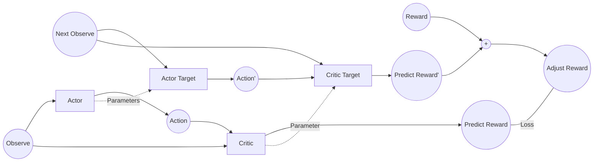
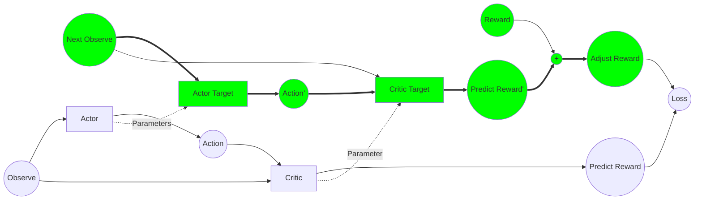
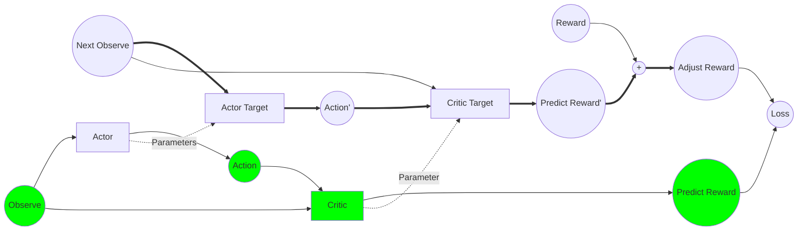
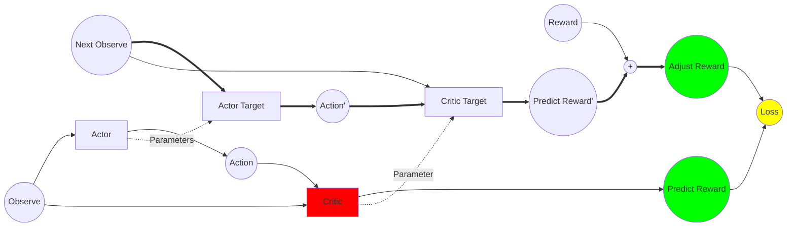
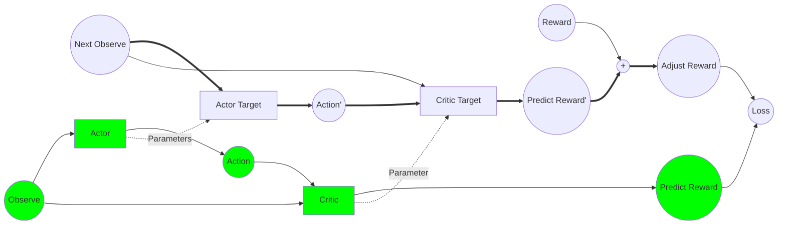
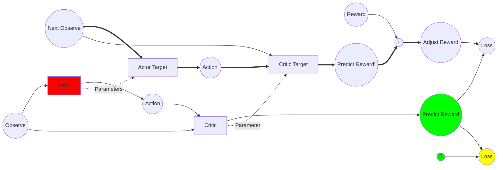
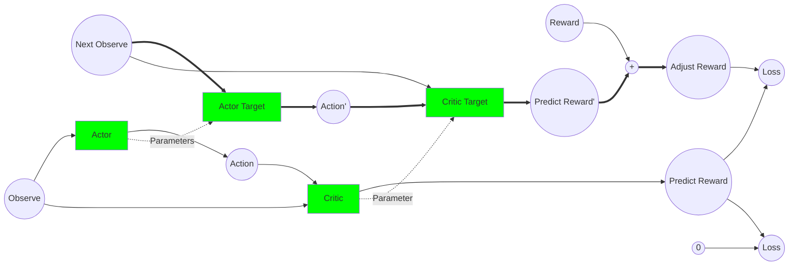

# 抛开数学公式理解DDPG

由于新冠疫情被关在家中,无事可做.就决定用这段时间研究一下连续控制的深度学习算法DDPG. 网上看了很多帖子,大多上来就列公式.对于我这种数学基础差的同学,很不友好.于是打算丢开数学公式讨论一下DDPG的核心思想.

## 应用场景
DDPG用于连续控制系统,比如,OpenAI的MountainCarContinuous. 在游戏中玩家可以对小车提供一个向左向右或大或小的力,最终把小车推到最右端的小旗处.

注: 一直向右推是无法将车推上坡的,需要利用小车自身感性.

http://gym.openai.com/envs/MountainCarContinuous-v0/

现在问题来了,我应该在什么时候往什么方向给小车施加一个多大的力,让小车最终到小旗处呢?

## DDPG
DDPG是Deep Deterministic Policy Gradient的缩写.主要有两个神经网络: Actor和Critic.
Actor负责通过输入的场景参数Observe,计算出应对的动作Action.
Critic负责通过输入的场景参数和Actor给出的Action,估算出一个评分Reward.
如果,Critic可以估算出和真实环境一样的得分.那么根据Critic的评分,可以指导Actor给出一个时刻最正确的Action(得分最高的).

下面详细讨论一下DDPG的训练过程.
### 训练数据收集
observe: 为当前场景参数. 比如在这个游戏中场景为两个数字,一个代表到谷底的水平距离正数为小车在谷底右侧,负数表示小车在谷底左侧,另一个代表小车的速度,正数代表小车在向右运动,负数代表小车在向左运动.
action: 为当前所对应的Action.
reward: gym在每一步动作之后会返回一个reward.但不一定有用.比如在这个游戏中,我将reward重新定义为observe[0] + abs(observe[1]*10) - 1.3. 原因稍后介绍.
next_observe: 为做完了action以后游戏返回的下一个场景参数.

### 训练过程

1. 使用随机产生的Action生成训练数据集.
2. 估算下一步的场景得分"predict reward" 并和当前的reward加权合并成新的Adjust Reward.

3. 估算出当前场景下,当前Action的得分Predict Reward.
   注意,这一步中的Action是使用训练数据的Action.

4. 根据第二步和第三步的结果,调整Critic的网络参数参数

5. 将当前的Observe输入到Actor得出Action,然后使用训练过的Critic对这个Action进行评估.得到Prediction Reward.

6. 最关键的一步. 刚才提到过我将reward重新定义为next_observe[0] + abs(next_observe[1]*10) - 1.3. 因为next_observe[0]是一个-1.2~0.6的数字, next_observe[1]是一个-0.07~0.07的数字.那么这个定义的意思就是通过Actor得到的Action的得分是一个小于0的负数.而和0的Loss做到最小的意思就是Action要让小车尽可能的靠近右侧,而且速度尽可能大(无论左右).这样,的小车最容易冲上右侧的山峰.

7. 将Actor的参数加扰之后更新到Actor Target, 将Critic的参数加扰之后更新到Critic Target.用于下次计算Adjust Reward.

